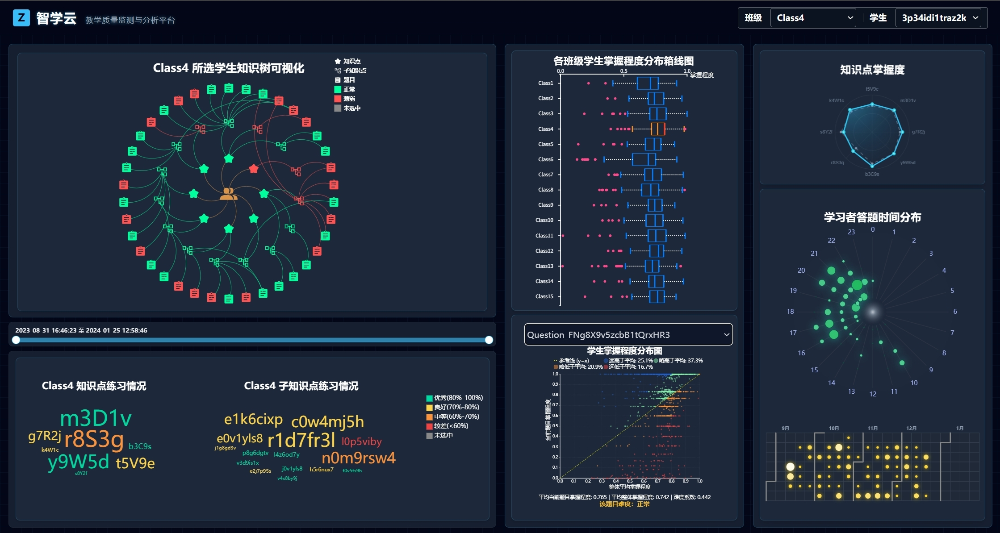
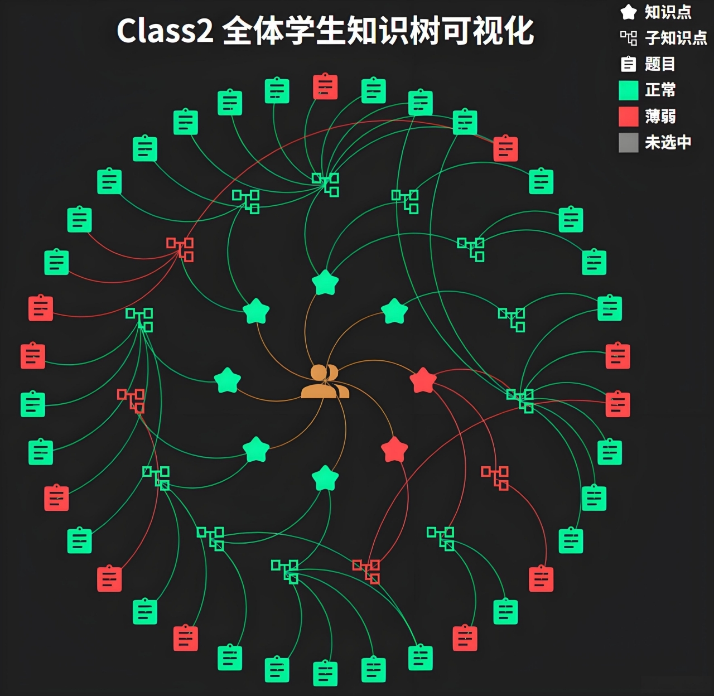
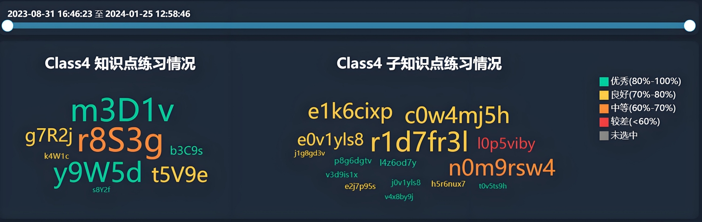
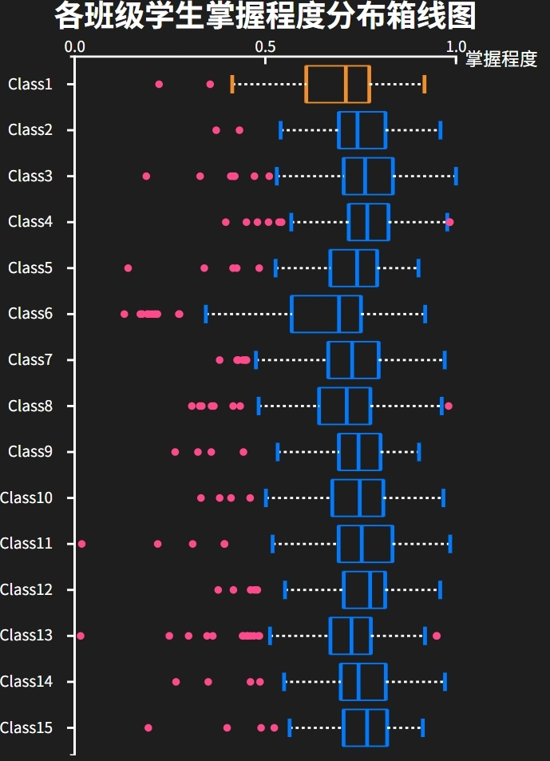
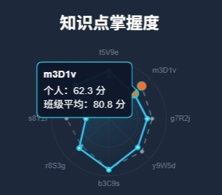
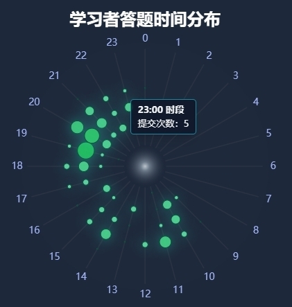
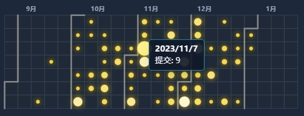
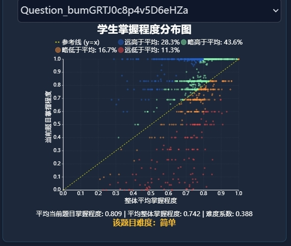

<div align="center">

 
  <h1>🎓 析数启智 EduVis Dashboard</h1>

  <p><b>基于时序多变量学习行为数据的教育可视分析平台</b></p>

  <!-- 第一行：基础技术栈 -->
  <p>
    
    
    
  </p>

  <!-- 第二行：可视化/交互库（按你们项目实际删改） -->
  <p>
    
    
    
    
  </p>

</div>

<hr/>

欢迎来到 **“析数启智”**，一个面向 **教学管理者** 与 **学习者** 的综合性教育数据可视分析平台。

本项目基于真实学习行为日志，通过构建多视图联动与交互式下钻分析界面，揭示个体与班级在学习过程中的 **行为特征** 与 **学习效果差异**，支持从宏观教学决策到微观个性化诊断的一体化分析。

本系统由三个核心层次组成：

- **数据与指标层 (Metric Layer)**：对原始提交日志进行清洗与特征工程，构建核心量化指标 **“题目掌握程度 (Item Proficiency)”**，支持任意粒度与群体的掌握度计算。  
- **联动可视化层 (Dashboard Layer)**：以“知识树”为主入口，联动词云、箱线图、雷达图、学习习惯时钟/日历与题目难度散点图，实现多维对比与逐层下钻。  
- **分析与诊断层 (Insight Layer)**：提供“班级差异分析 + 知识薄弱定位 + 个体学习画像 + 题目难度验证”的闭环分析能力，并能复现典型案例（如 Class4 的薄弱知识点与突击学习现象）。

---

## 👥 开发团队 (Development Team)

组名：**“视不可挡”队**  
成员：  

- 袁煜杰 (后台管理界面)  
- 王奕瑜 (班级分析界面设计)
- 赵宇哲 (前端 html 维护+学生查询界面设计)  

---

## 🌟 项目一览 (Project Showcase)

本项目基于 **ChinaVis 2024「析数启智」挑战赛数据集**开发，数据覆盖：  
- **15 个班级**、**1364 名学习者**  
- **148 天**学习周期（2023-08-31 ～ 2024-01-25）  
- **232,818 条**编程答题行为日志


<!-- 你也可以用九宫格/拼图展示，这里先放一张总览 -->


---

## 🎯 核心目标

- **多层级分析**：实现“知识点 → 子知识点 → 题目”与“年级 → 班级 → 学生”的逐层下钻  
- **异常发现**：识别偏科、突击学习、复习不足、异常个体/班级等模式  
- **时序演化**：展示掌握程度随时间的动态变化与学习轨迹  

---

## ✨ 核心可视化功能 (Key Features)
系统从左至右将教学看板划分为三个联动维度，实现宏观管理与微观诊断的有机结合。

> 📷 截图路径：`assets/imgs/`（按 1→8 编号）

### 1) 🌳 知识树面板 (Knowledge Tree)
作为系统主入口，展示 `知识点 — 子知识点 — 题目` 的三级层次结构。
- **状态映射**：绿色 = 高于平均水平；红色 = 薄弱环节
- **交互联动**：点击节点触发跨层级高亮与灰态隔离，直观呈现从属关系与关联链路




---

### 2) ☁️ 动态词云与时间轴 (Dynamic Word Cloud)
结合时间滑动条的创新词云设计，用于分析特定时间段内练习情况。
- **动态映射**：文本大小 = 练习次数；颜色 = 掌握度等级（优/良/中/差）
- **等时长分析**：支持拖拽时间滑块进行滚动对比，定位“考前突击 / 前期遗忘”等现象



---

### 3) 📦 班级分布箱线图 (Class Distribution Boxplot)
充当数据“索引器”，用于横向对比班级水平与定位异常个体。
- **异常捕捉**：离群点定位偏离均值个体，支持查看学生信息
- **班级追踪**：选中特定学生后高亮其在班级分布中的相对位次



---

### 4) 🕸️ 知识掌握度雷达图 (Proficiency Radar Chart)
为学习者生成精细化知识结构画像。
- **边界对比**：青色光晕 = 个人能力边界；灰色虚线 = 班级均值
- **形态诊断**：识别“全面发展型”（饱满）vs “偏科型”（尖锐）



---

### 5) 🕒 学习习惯时钟与日历图 (Learning Habit Profiling)
将线性时间卷曲，揭示学生行为规律，支撑从“结果”追溯到“过程”。
- **极坐标时钟图**：展示 24h 活跃规律，识别“熬夜型 / 持续型”学习者
- **日历图**：气泡大小映射每日工作量，识别“刷题周 / 休整期”





---

### 6) 🎯 题目难度散点图 (Difficulty Scatter Plot)
- 横轴：学生整体平均掌握度  
- 纵轴：当前题目掌握度  
通过差值区间划分题目难度系数，辅助题库管理者验证并优化题目设置合理性。



---

## 🔍 分析发现案例（Case Study: Class 4）
系统不仅是展示工具，更是可复现的分析引擎。以 **Class 4** 为例：

1. **宏观发现**：箱线图显示该班整体水平靠前，但知识树提示知识点 `r8S3g` 显著薄弱（飘红）
2. **时序深挖**：词云 + 时间轴显示 `r8S3g` 前期练习多，但中后期复习严重不足
3. **归因分析**：散点图显示该知识点下题目多为“复杂”难度  
 → 证实“缺乏后期复习 + 题目难度偏高”导致最终薄弱
4. **个体诊断**：下钻至垫底学生 `90f3fbedfce50f644011`  
 雷达图与日历图揭示：严重偏科 + “期末熬夜突击”习惯  
 → 为个性化辅导提供直接证据与干预方向

---

## 🚀 快速开始 (Quick Start)

建议在浏览器中以缩放比例 75%-80% 打开

### 方法 A：VS Code Live Server（推荐）
1. 使用 VS Code 打开项目
2. 安装插件 **Live Server**
3. 右键 `index.html` → **Open with Live Server**

### 方法 B：http-server（推荐）
```bash
npm install -g http-server
http-server -o /index.html
